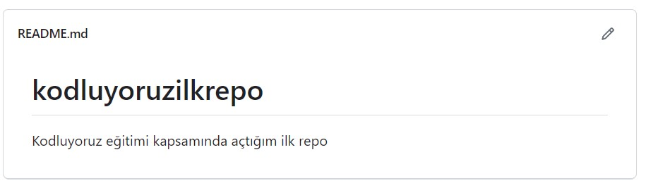

# Kodluyoruz İlk Repo

Bu repo [Kodluyoruz](https://academy.patika.dev/tr/courses/git/odev1) Front-End Eğitiminde oluşturduğumuz ilk repo. İçerisinde bir adet README dosyası, bir adet de hey.java barındırıyor.

()


## Installation

Öncelikle projeyi clonelayın.(Buraya sizin reponuzdan aldığınız link gelecek)

'''bash
https://github.com/esrayld/kodluyoruzilkrepo.git
'''
##Usage

Projeyi cloneladıktan sonra Visual Studio Code programında açınız.

Linux için:

```linux
cd kodluyoruzilkrepo
code .
```

## Contributing
Pull requestler kabul edilir. Büyük değişiklikler için, lütfen önce neyi değiştirmek istediğinizi tartışmak için bir konu açınız.


## License
[MIT](https://choosealicense.com/licenses/mit/)
